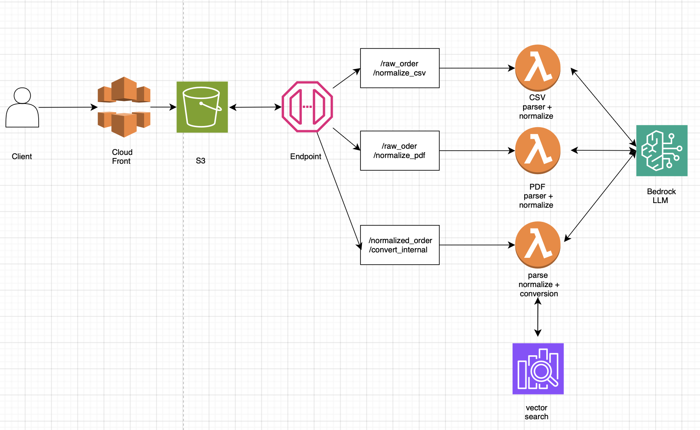
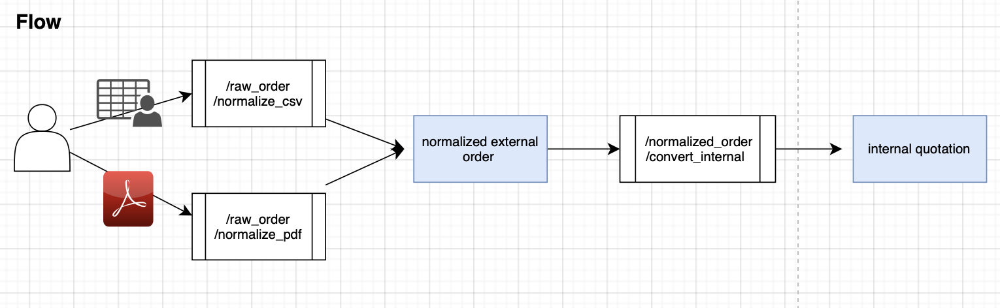

# AI System Design Planning for Production Implementation
This documentation ellaborates 

- [Revisit Goal](#revisit-goal)
- [Task definitions by AI](#task-definitions-by-ai)
- [Algorithm selection and option definition](#algorithm-selection-and-option-definition)
- [Selection including architecture and operational costs when systematized](#selection-including-architecture-and-operational-costs-when-systematized)


# Revisit Goal
The goal is to automate the conversion of CSV/PDF orders into accurate internal quotations — reducing manual work and supporting diverse input formats.

To achieve this, the system must meet the following criteria:

### 1. Functional Accuracy

- **Input Accuracy**: Raw CSV and PDF files must be received and parsed without content loss.
- **Normalization**: Convert diverse input formats into a standardized JSON structure.
- **Product Mapping**: Accurately map external product names to internal product names and IDs.

### 2. Performance

- **Low Latency**: Quick response time from input upload to quotation output.
- **Scalable Throughput**: System must handle:
  - 117 franchises × 30 quotations/week
  - ≥ 3,500 quotation generations per week

### 3. Cost Efficiency

- **Infrastructure**: 
  - I/O handling
  - LLM generation
  - Vector search
- **Hosting**:
  - API services
  - Database
  - Static website (e.g., S3 + CloudFront)
 


#  Task Definitions by AI

This section outlines the tasks our AI system is expected to automate, based on learnings from the PoC.

## ✅ Workflow Overview

See diagram below for end-to-end flow:


## 🔄 Tasks Requiring Automation

We break down the key steps where AI is involved:

- **External CSV → Normalized JSON**
  - Parse CSV input  
  - Convert to structured JSON format  🤖[1]

- **External PDF → Normalized JSON**
  - Extract text via OCR  🤖[2]
  - Convert to structured JSON format  🤖[3]

- **Normalized JSON → Internal Quotation**
  - Iterate over each product  
  - Retrieve similar product names from reference DB  🤖[4]
  - Generate internal product name + ID  🤖[5]
  - Output structured quotation JSON  🤖[5]

> Steps with 🤖 indicate where AI components are applied.

📎 For sample input/output examples, refer to the [PoC Update (Jul 18)](https://github.com/novatrade-co-jp/okadahd-quotation/tree/app/phase1-backend?tab=readme-ov-file#raw-data-to-normalized-csv).


## 🤖 Steps Where AI Is Required

This section outlines the concrete AI features we need to build.

### 🤖[1] & 🤖[3] -  Convert Order Data to Standardized JSON

We need to build an AI component that transforms input tables from various vendors (CSV or OCRed PDF) into a **standardized JSON structure**.

#### ✅ What to Build
- A prompt-based LLM function that:
  - Accepts inconsistent tables as input (headers/fields may differ)
  - Outputs a JSON array with unified field names:
    - `external_product_name`
    - `quantities`
    - `unit`
    - `company_name`
    - `construction_number`

    
- Input 
    - From construction company A 
        ``` 
        品名	規格	請求数	工事番号	工事名称
        ケーブル	IV1.25sq 黄	2巻	25-0261	荒川化学工業
        ケーブル	KIV1.25sq 青	2巻	25-0261	荒川化学工業
        ケーブル	KIV0.75sq 青	2巻	25-0261	荒川化学工業
        ケーブル	HC-5L2	1巻	25-0261	荒川化学工業
        ``` 
    - From construction company B
        ```  
        | 品名          | 請求数 | 得意様番号 |
        | -------------- | --- | ----- |
        | ケーブル IV1.25sq 黄  | 2巻  | 4389  |
        | ケーブル  KIV1.25sq 青 | 2巻  | 4389  |
        | ケーブル  KIV0.75sq 青 | 2巻  | 4389  |
        | ケーブル HC-5L2      | 1巻  | 4389  |
        ``` 
- Output 
    - standardized fields order
        ``` 
        {
        "components": [
            {
            "external_product_name": "ケーブル IV1.25sq 黄",
            "quantities": 2,
            "unit": "巻",
            "company_name": "荒川化学工業",
            "construction_number": "25-0261"
            },
            {
            "external_product_name": "ケーブル KIV1.25sq 青",
            "quantities": 2,
            "unit": "巻",
            "company_name": "荒川化学工業",
            "construction_number": "25-0261"
            },
            {
            "external_product_name": "ケーブル KIV0.75sq 青",
            "quantities": 2,
            "unit": "巻",
            "company_name": "荒川化学工業",
            "construction_number": "25-0261"
            },
            {
            "external_product_name": "ケーブル HC-5L2",
            "quantities": 1,
            "unit": "巻",
            "company_name": "荒川化学工業",
            "construction_number": "25-0261"
            }
        ]
        }
        ```
### 🤖[2] — Parse PDF and Extract to Standardized JSON

This step builds the pipeline that handles PDF input and converts it into structured, machine-readable data.

#### ✅ What Needs to Be Built

We need to implement a system that can:

1. **Read PDF files** (uploaded by franchises).
2. **Extract key text and table content**, including:
   - Construction number (`工事番号`)
   - Company name (`工事名称`)
   - List of ordered items with:
     - Product name
     - Specification
     - Quantity
     - Unit
3. **Convert extracted content into standardized JSON** format:

    ``` 
    {
    "components": [
        {
        "external_product_name": "...",
        "quantities": ...,
        "unit": "...",
        "company_name": "...",
        "construction_number": "..."
        }
    ]
    }
    ``` 


### 🤖[4] — Query Relevant Product Name from Reference Table

This step builds the lookup mechanism to assist product name conversion.

---

#### ✅ What Needs to Be Built

We need to implement a **semantic search** function that:

1. **Receives an external product name** from the normalized input (e.g., `"自在バンドIBT212φ370以内"`).
2. **Queries the reference database** (or vector search index) for similar entries.
3. **Returns the most relevant internal product name and ID**, based on meaning—not just exact match.

---

#### 🧾 Example

| Field                   | Value                          |
|------------------------|---------------------------------|
| `external_product_name` | 自在バンドIBT212φ370以内         |
| `internal_product_name` | 自在バンド(最大370φ)              |
| `internal_product_id`   | IBT212                          |
| `embedded_target`       | internal_product_name           |
| `ID`                    | id_2753532c-74bd-4c03-9baa-d31697d41122 |

---

This result will be passed to the next step 🤖[5] for generating the final quotation output.


### 🤖[5] — Construct Internal Product Name + ID Based on Similar Candidates

This step generates the final `internal_product_name` and `internal_product_id` from a list of similar product name candidates.

---

#### ✅ What Needs to Be Built

We need an **LLM-based generation module** that:

1. **Receives**:
   - An `external_product_name`
   - A list of similar `internal_product_name` candidates from 🤖[4]

2. **Outputs**:
   - A clean and valid `internal_product_name`
   - The corresponding `internal_product_id`

---

#### 🧪 Example

**Input:**

``` 
{
  "external_product_name": "自在バンドIBT212φ370以内",
  "similar_candidates": [
    { "internal_product_name": "自在バンド(最大370φ)", "internal_product_id": "IBT212" },
    { "internal_product_name": "自在バンド(300φ以内)", "internal_product_id": "IBT200" },
    { "internal_product_name": "配管支持バンド370mm", "internal_product_id": "SUP370" }
  ]
}
```


# Algorithm selection and option definition 
Algorithm selection refers to choosing the core method or model that will power our AI solution.

## 🔧 Algorithm Selection

| Task | Description                                 | Technique                          | Reason                                  |
|------|---------------------------------------------|------------------------------------|-----------------------------------------|
| 🤖[1] | Convert CSV/PDF to structured JSON          | Table extraction + schema mapping  | Handles varied formats from vendors     |
| 🤖[2] | Extract text from scanned PDFs              | OCR                                | Converts images to machine-readable text |
| 🤖[3] | Normalize field names and units             | Token classification + NER         | Unifies inconsistent headers/units      |
| 🤖[4] | Find matching internal product names        | Semantic search (embedding-based)  | Finds close matches despite variation   |
| 🤖[5] | Generate final internal name + ID           | LLM + rule validation              | Ensures correct, clean product mapping  |


## Option definition 
Algorithm selection refers to choosing the core method or model that will power our AI solution.

### ➤ Choosing LLM Provider

LLMs are used in the following steps:
- 🤖[1] Convert order formats to structured JSON  
- 🤖[3] Normalize field names and units  
- 🤖[5] Generate internal product name and ID  

**Recommendation:**  
We used Open AI 4o structure output as our PoC, but some other low cost model might be worth trying. 
Gemini 2.5 is a strong candidate for experimentation due to its lower cost and high scalability, while maintaining competitive accuracy and speed.


### ➤ Choosing OCR

#### ✅ What Needs to Be Built

We need an OCR pipeline that:

1. **Parses Japanese PDF files** (structured order slips)
2. **Extracts**:
   - Text and tables (product name, quantity, unit)
   - Metadata (construction number, company name)
3. **Outputs a dictionary** with:
   - `text_pages`: extracted text by page
   - `tables`: structured tables with page info
4. **Passes this output to the LLM** for normalization into standardized JSON

The system must handle:
- Variations in layout and table structure across franchises
- Mixed units (e.g., 巻, 箱, ケ)
- Occasional handwritten entries
- ~500 PDFs per day

---

#### 🔧 Current OCR Approach

- **Step 1: PDF Extraction**
  - FastAPI endpoint reads PDF in bytes
  - Uses `pdfplumber` to extract:
    - Text (`text_pages`)
    - Tables (`tables`)
- **Step 2: JSON Conversion**
  - Pass the extracted content to an LLM
  - LLM outputs normalized JSON structure

---

#### 🧠 Key Insights

- The first step (OCR) doesn't need to be perfect—LLM handles field alignment.
- Current pipeline:
  - Works well for clean PDFs
  - May need fallback for handwritten or scanned docs
- For high volume:
  - Use Lambda + parallel processing
  - Batch LLM calls for efficiency

---

#### 💰 Cost Estimate (Per PDF)

| Component       | Method        | Cost (USD)   |
|----------------|---------------|--------------|
| PDF Extraction  | Lambda + pdfplumber | ~$0.00002  |
| LLM (620 tokens) | Bedrock/OpenAI | Based on token pricing |

---

We can continue with `pdfplumber`, or explore more advanced OCR options if accuracy on handwritten/complex PDFs becomes a bottleneck.


#### 📊 OCR Comparison (Summary)

| Solution              | Cost (per 1K pages)     | JP Text & Table Accuracy     | Throughput & Scalability     |
|-----------------------|--------------------------|-------------------------------|-------------------------------|
| **ABBYY FlexiCapture** | 💰 High ($2–$4/page or license) | ⭐⭐⭐⭐⭐ Best-in-class, accurate tables | ⭐⭐⭐⭐⭐ On-prem, 25k+/day |
| **Azure Form Recognizer** | 💲 $1.50–$15               | ⭐⭐⭐⭐ Good JP, customizable     | ⭐⭐⭐⭐⭐ Cloud, 10k+/day         |
| **AWS Textract**       | 💲 $1.50–$3.50              | ⭐⭐⭐⭐ JSON by cell, moderate tables | ⭐⭐⭐⭐⭐ Highly scalable         |
| **Google DocAI**       | 💲 $1.50–$3.00              | ⭐⭐⭐⭐ Strong OCR, decent tables | ⭐⭐⭐⭐⭐ Async & scalable        |
| **Naver CLOVA OCR**    | 💲 $3–$5                    | ⭐⭐⭐⭐ Optimized for JP/KR       | ⭐⭐⭐⭐ Good for Asia, 1k–10k/day |


### -> Choosing Vector Search  
We have the following options. 
Based on this table, we believe having a deep integration with aws is critical. 

Thus, we will adopt aws open search.


### 🗃️ Vector Database Comparison

| Database              | Accuracy ⭐ | Latency ⚡ | Throughput 📈 | Cost (Per Query) 💰 | Infra/Ops Cost 🛠️ | Key Notes                                                                 |
|-----------------------|------------|-----------|----------------|----------------------|-------------------|---------------------------------------------------------------------------|
| **Milvus**            | 5          | 5         | 5              | 5                    | 4 (self-managed)  | High recall, strong filtering, open-source, scales massively              |
| **Pinecone**          | 5          | 5         | 5              | 3–4                  | 3 (managed)       | Reliable managed cloud, scalable, higher recurring cost                  |
| **Qdrant**            | 4.5        | 5         | 4.5            | 5                    | 4 (self-managed)  | Low-latency, easy scaling, open-source, cost-effective                    |
| **OpenSearch (AWS)**  | 4          | 3.5–4     | 5              | 3–4                  | 3 (cloud PAYG)    | Cost-efficient with vector buckets, recall may drop under filtering       |
| **Chroma**            | 4          | 4         | 3.5            | 5                    | 5 (self-managed)  | Simple, great for prototyping or small/medium scale, open-source          |
| **PostgreSQL + pgvector** | 4      | 3.5–4     | 3              | 5                    | 5 (self-managed)  | Best for hybrid SQL/vector use, ideal if PostgreSQL is already in stack   |


# Selection including architecture and operational costs when systematized

### 📐 Architecture Overview



- **Client**: Uploads CSV or PDF files via the web interface
- **CloudFront**: CDN to accelerate loading of the client interface
- **S3**: Hosts static frontend assets
- **API Gateway + Lambda Endpoints**:
  - `/raw_order/normalize_csv`: Handles raw CSV input → normalized JSON
  - `/raw_order/normalize_pdf`: Handles PDF input → OCR → normalized JSON
  - `/normalized_order/convert_internal`: Handles normalized JSON → internal product name/ID mapping
- **Bedrock LLM**:
  - Step 1: Normalize raw input fields
  - Step 2: Construct internal product name + ID
- **Vector Search (e.g. Pinecone)**:
  - Retrieves candidate internal product names for mapping

---

### 🔄 Application Flow



1. **Client uploads** either a CSV or PDF file.
2. **File is routed** to the appropriate Lambda endpoint:
   - **CSV** → `/raw_order/normalize_csv`
     - Converts to JSON
     - Passes to LLM for normalization
   - **PDF** → `/raw_order/normalize_pdf`
     - Extracts text via OCR
     - Converts to JSON
     - Passes to LLM for normalization
3. **Normalized JSON** is sent to `/normalized_order/convert_internal`:
   - For each product:
     - Query vector search for similar internal product names
     - Use LLM to finalize internal product name + ID

    

## Operational Cost  

This document outlines the estimated monthly cost for processing quotation files (CSV and PDF) for 117 franchises. 
Each franchise submits 50 single-page quotations per week, with each page containing 18 products.

---

### Monthly Cost Estimation per Format

| Format | Cost per Page | Quotations/Week (per Franchise) | Weekly Cost (per Franchise) | Monthly Cost (per Franchise) | Monthly Cost (117 Franchises) |
|--------|----------------|----------------------------------|-----------------------------|------------------------------|-------------------------------|
| **CSV** | $0.00352060     | 50                               | $0.17603                    | $0.70412                     | **$81.90**                    |
| **PDF** | $0.00365160     | 50                               | $0.18258                    | $0.73032                     | **$85.45**                    |

---

### 💰 Total Monthly Cost for All 117 Franchises

**$81.90 (CSV) + $85.45 (PDF) + Vector Search subscription =  $217 USD (32222.62 YEN)** 

 
### See Detail Cost breakdown 
see docs/AIDesign/cost.md 

- ACCURACY, LATENCY, SCALABLE THROUGHPUT,EXPENSIVE OR LOW COST(INFRA,HOSTING)
