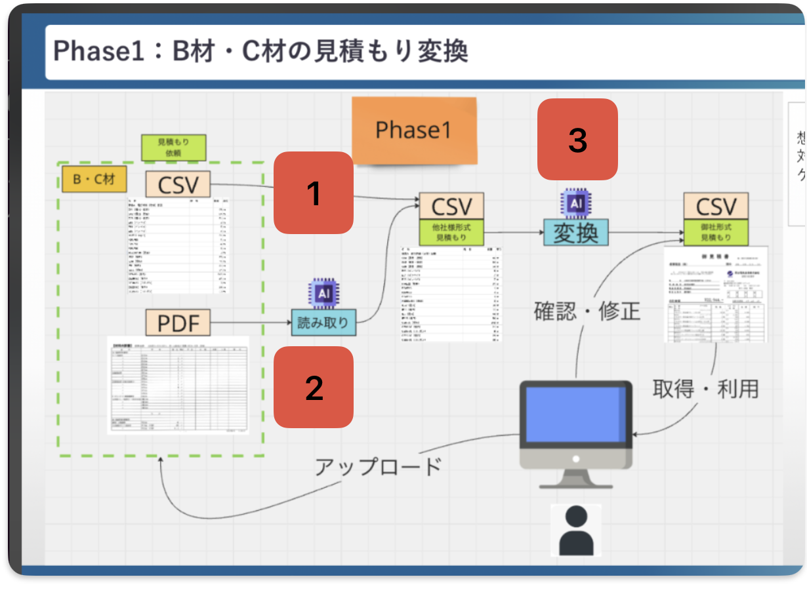
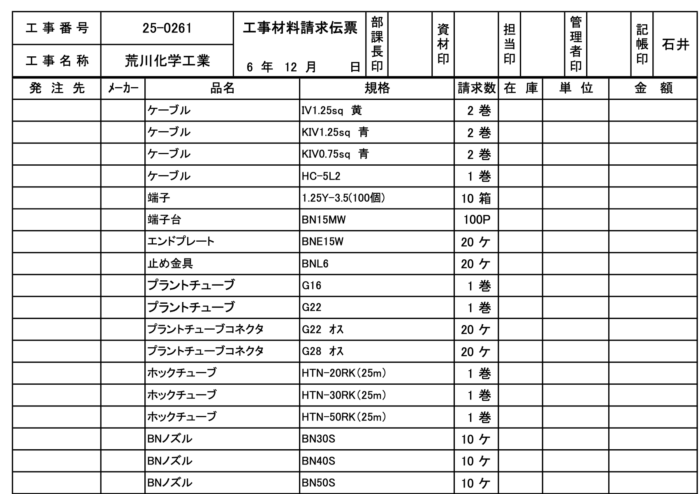

# About this repo
- implementation of phase 1, focused on backend

# Goal of Project
- we have two entities :
    - construction companies (okada's clients)
    - okada employers (okada is a company that sells construction components)
- okada employers will be using this software
- construction companies will order construction components on a single order written with various formats. this includes.
    - pdf
    - csv
- within each order, construction companies will write the components in their own language
    - example :
        ```
        {
        "customer_id": "5124055c-a65b-467b-a6f1-62529c0d6b4c",
        "quantity": 2,
        "external_product_name": "ケーブル(管内)IV1.6x5",
        "internal_product_name": "600V IV1.6 赤・白・黒・青・緑",
        "internal_product_id": "IV16"
        },
        ```
        as seen here, ケーブル(管内)IV1.6x5 is contruction company language, while 600V IV1.6 赤・白・黒・青・緑 is the okada company language.
- traditionally, okada has been manually converting 'external_product_name' to 'internal_product_name' by hand. This is very inefficient, thus automation is required.
- our goal is
    - given a single order from construction companies in various file types ( also, each component written in their language)
    - we want a system to output an okada internal use quotation where
        - each construction component is already written in okada's language


# Process
here, we try to understand the kind of data involved and the operations applied.

## Overall System
Explanation :
- On the far left, we see csv and pdf.
    - these are the construction companies orders where each component are written in their language
- in the middle, we see csv
    - construction companies order where only selected & specified data fields are remained.
    - we call this csv as "normalized csv"
- on the far right, we see csv
    - this is the construction companies order where each construction component is already converted to okada's language.


For the back end, we will mainly create 3 endpoints.
- endpoint 1 : External CSV to External Normalize CSV
- endpoint 2 : External PDF to External Normalize CSV  
- endpoint 3 : External Normalize CSV to Internal CSV

these endpoints are marked with red squares in the diagram.

## Raw data to normalized csv
### endpoint 1 : External CSV to External Normalize CSV

#### Input
- From construction company A
    ```
    品名	規格	請求数	工事番号	工事名称
    ケーブル	IV1.25sq 黄	2巻	25-0261	荒川化学工業
    ケーブル	KIV1.25sq 青	2巻	25-0261	荒川化学工業
    ケーブル	KIV0.75sq 青	2巻	25-0261	荒川化学工業
    ケーブル	HC-5L2	1巻	25-0261	荒川化学工業
    ```
- From construction company B
    ```  
    | 品名          | 請求数 | 得意様番号 |
    | -------------- | --- | ----- |
    | ケーブル IV1.25sq 黄  | 2巻  | 4389  |
    | ケーブル  KIV1.25sq 青 | 2巻  | 4389  |
    | ケーブル  KIV0.75sq 青 | 2巻  | 4389  |
    | ケーブル HC-5L2      | 1巻  | 4389  |
    ```
    as seen here, different construction companies writes their order with different data fields, thus its required to have a csv with predefined data fields.  For instance, construction A writes a single product name across multiple columns, while construction B writes in a single column.


#### output
-
    ```
    {
    "components": [
        {
        "external_product_name": "ケーブル IV1.25sq 黄",
        "quantities": 2,
        "unit": "巻",
        "company_name": "荒川化学工業",
        "construction_number": "25-0261"
        },
        {
        "external_product_name": "ケーブル KIV1.25sq 青",
        "quantities": 2,
        "unit": "巻",
        "company_name": "荒川化学工業",
        "construction_number": "25-0261"
        },
        {
        "external_product_name": "ケーブル KIV0.75sq 青",
        "quantities": 2,
        "unit": "巻",
        "company_name": "荒川化学工業",
        "construction_number": "25-0261"
        },
        {
        "external_product_name": "ケーブル HC-5L2",
        "quantities": 1,
        "unit": "巻",
        "company_name": "荒川化学工業",
        "construction_number": "25-0261"
        }
    ]
    }
    ```
    So, here we want external orders where data fields that's already predefined from our side.
### 2. endpoint 2 : External PDF to External Normalize CSV
in this process, we use OCR to capture the pdf and return extracted data.


- Input

this is one sample. But, we can expect the pdf comes in many other forms. For instance, a pdf order where company name or construction number might not even be written.
- Output

    Note that, this is the same output data structure as endpoint 1.

    ``` {
        "components": [
        {
            "external_product_name": "ケーブル IV1.25sq 黄",
            "quantities": 2,
            "unit": "巻",
            "company_name": "荒川化学工業",
            "construction_number": "25-0261"
        },
        {
            "external_product_name": "ケーブル KIV1.25sq 青",
            "quantities": 2,
            "unit": "巻",
            "company_name": "荒川化学工業",
            "construction_number": "25-0261"
        },
        {
            "external_product_name": "ケーブル KIV0.75sq 青",
            "quantities": 2,
            "unit": "巻",
            "company_name": "荒川化学工業",
            "construction_number": "25-0261"
        },
        {
            "external_product_name": "ケーブル HC-5L2",
            "quantities": 1,
            "unit": "巻",
            "company_name": "荒川化学工業",
            "construction_number": "25-0261"
        },
        {
            "external_product_name": "端子 1.25Y-3.5(100個)",
            "quantities": 10,
            "unit": "箱",
            "company_name": "荒川化学工業",
            "construction_number": "25-0261"
        },
        {
            "external_product_name": "端子台 BN15MW",
            "quantities": 100,
            "unit": "P",
            "company_name": "荒川化学工業",
            "construction_number": "25-0261"
        }
        ]
    }
    ```

### endpoint 3 : External Normalize CSV to Internal CSV
- input

    this is the output of endpoint 1 and 2.
    (normalized csv)

    ```
        {
        "components": [
            {
            "external_product_name": "ケーブル IV1.25sq 黄",
            "quantities": 2,
            "unit": "巻",
            "company_name": "荒川化学工業",
            "construction_number": "25-0261"
            },
            {
            "external_product_name": "ケーブル KIV1.25sq 青",
            "quantities": 2,
            "unit": "巻",
            "company_name": "荒川化学工業",
            "construction_number": "25-0261"
            },
            {
            "external_product_name": "ケーブル KIV0.75sq 青",
            "quantities": 2,
            "unit": "巻",
            "company_name": "荒川化学工業",
            "construction_number": "25-0261"
            },
            {
            "external_product_name": "ケーブル HC-5L2",
            "quantities": 1,
            "unit": "巻",
            "company_name": "荒川化学工業",
            "construction_number": "25-0261"
            }
        ]
        }
 - output

    the main sauce here is :

    for each construction component,

    we have used "external_product_name"

    to get  "internal_product_name" and "internal_product_id".

    ```
    {
        "records": [
            {
            "customer_id": "123456",
            "quantity": 2,
            "external_product_name": "ケーブル IV1.25sq 黄",
            "internal_product_name": "600V IV1.6 赤・白・黒・青・緑",
            "internal_product_id": "IV16"
            },
            {
            "customer_id": "荒川化学工業",
            "quantity": 2,
            "external_product_name": "ケーブル KIV1.25sq 青",
            "internal_product_name": "600V IV1.6 赤・白・黒・青・緑",
            "internal_product_id": "IV16"
            },
            {
            "customer_id": "123456",
            "quantity": 2,
            "external_product_name": "ケーブル KIV0.75sq 青",
            "internal_product_name": "マイクコード MVVS0.75X2C",
            "internal_product_id": "MVVS0752"
            },
            {
            "customer_id": "123456",
            "quantity": 1,
            "external_product_name": "ケーブル HC-5L2",
            "internal_product_name": "ECX 5C-2V",
            "internal_product_id": "5C2V"
            }
        ]
    }
    ```

# More Details
## Endpoints
```
- endpoint 1 : External CSV to External Normalize CSV
    => POST /raw_order/normalize_csv

- endpoint 2 : External PDF to External Normalize CSV  
    => POST /raw_order/normalize_pdf

- endpoint 3 : External Normalize CSV to Internal CSV
    => POST /normalized_order/convert_internal
```
## Directory structure
here we list the files, and their purpose.
```
app/
├── dependencies/
│   └── llm.py                      # get open ai client to use LLM
│   └── vector_database.py          # inputs a single product name and returns similar product names along product ID
├── routers/
│   ├── normalized_order.py         # manages subendpoint /normalized_order
│   └── raw_order.py                # manages subendpoint /raw_order
├── schemas/    
│   ├── converted_order.py          # defines data model output for end point 3
│   └── normalized_order.py         # defines data model output for endpoint 1 & 2
├── services/
│   ├── order_converter.py          # receives normalized csv, convert each product name, then return internal quotation(final)
│   └── order_normalizer.py         # receives a raw csv content in json, then LLM rearrange its content into predefined data fields.
├── main.py                         # includes all routers
```

## Key Consideration
### Cost
- this is the part yet calculated
- but overall LLM generation cost is very control as we structure output.
- and each output is quite minimum.
- we can optimize this by parsing less input tokens.
### Latency  
we have use
- LLM so far on converting data structure
- Serverless vector database
- lighweight pdf extractor

these operations does not impact the speed of overall conversion.
### Quality
- this part heavily relies on accuracy of converting external product name to internal ones.
- overall, 12k (internal+external) product names are pre ingested in serverless pinecone data.
- At this point, we are confident that overall conversion is correct.

### [Key Suggestion]
- by kouki
- the key is to maintain all operations to be lightweight. This reduce cost, latency, quality.
- this includes

    - use vectordatabase, don't use heavy NLP models. Vector similiarty is your best friend, their computation time is just fast. Also, pre ingest vectors in a serverless vectordatabase, then invoke similar products at the endpoint.
    - If we're parsing data to LLM, try reduce the input token count. In contrast, if we're asking LLM to output, use structure output to reduce output token count. This reduce latency and cost.
    - try to use lightweight OCR, then parse to LLM to get the proper data structure. Heavy OCR is not required in our use case. pdfplumber OCR already did a good job.  Hosting heavy ocr will increase latency and cost. As long as overall text content are extracte and even its not well structure its enough, because LLM will structure the raw content.

# Using This Repo

only the back end is completed, front is in construction.
1. clone this repo
2. create virtual environment from root directory
    ```
    python3 -m venv venv
    ```
3. activate virtual environment
    ```
    source venv/bin/activate
    ```
4. install dependencies within virtual environment
    ```
    pip install -r requirements.txt
    ```
5. create an .env and add api keys
    ```
    OPENAI_API_KEY =  
    PINECONE_API_KEY  =
    PINECONE_INDEX_NAME =
    ```

    Warning on OPENAI_API_KEY, if you get a quota limit issue.
    I suggest try using a personal api key with some balance loaded.
    the key provided from novatrade gives error.
6. point to root directory write command to start fast api locally
    ```
    uvicorn app.main:app --reload
    
    ```uvicorn app.main:app --reload --port 8000

7. open in browser to use endpoints
    ```
    INFO:     Uvicorn running on http://127.0.0.1:8000 (Press CTRL+C to quit)
    INFO:     Started reloader process [52698] using WatchFiles
    INFO:     Started server process [52701]
    INFO:     Waiting for application startup.
    ```

    your end point + /docs
    e.g. http://127.0.0.1:8000/docs

to test out some data
- sampledata/sample_input.csv to /raw_order/normalize_csv  # quite short
- sampledata/sample_input.pdf to /raw_order/normalize_pdf  # this takes longer
- the below data to /normalized_order/convert_internal

    ```
    {
        "components": [
            {
            "external_product_name": "ケーブル IV1.25sq 黄",
            "quantities": 2,
            "unit": "巻",
            "company_name": "荒川化学工業",
            "construction_number": "25-0261"
            },
            {
            "external_product_name": "ケーブル KIV1.25sq 青",
            "quantities": 2,
            "unit": "巻",
            "company_name": "荒川化学工業",
            "construction_number": "25-0261"
            },
            {
            "external_product_name": "ケーブル KIV0.75sq 青",
            "quantities": 2,
            "unit": "巻",
            "company_name": "荒川化学工業",
            "construction_number": "25-0261"
            },
            {
            "external_product_name": "ケーブル HC-5L2",
            "quantities": 1,
            "unit": "巻",
            "company_name": "荒川化学工業",
            "construction_number": "25-0261"
            }
        ]
        }
    ```
